# Acorn Email Template

<!-- img src="https://d3vv6lp55qjaqc.cloudfront.net/items/1L1w0v431V0d1K410f3Y/keepAChangelog-logo-dark.svg" height=150 alt="Keep a Changelog" / -->

[](./LICENSE)
[](./CHANGELOG.md)

### Contenido

+ [Librerías](#librerías)
+ [Instalación](#instalación)
+ [Importación](#importación)
+ [Ejemplo](#ejemplo)
+ [Métodos](#métodos)
+ [Componentes](#componentes)
+ [Tipos](#tipos)
+ [Estilos](#estilos)
+ [Ejemplos reales](#ejemplos-reales)

#### Librerías
Proyecto original:
- [Acorn Email Framework](http://docs.thememountain.com/acorn/)

Dependencias:
- [Zod](https://zod.dev/)
- [Handlebars](https://handlebarsjs.com/)

Colores:
- [Material design](https://material.io/resources/color/#!/?view.left=0&view.right=0)

#### Instalación
```
npm install acormail.js, zod
yarn add acornmail.js, zod
```

#### Importación
```js
import * as acornmail from 'acormail.js'
```

#### Ejemplo
Más ejemplos [aquí](./_examples/)
```js
import * as acornmail from 'acormail.js'

func main() {

    const acorn = acornmail.NewAcornEmailComponents();

    const aligns = acornmail.acornStyles.align;
    const { colors } = acornmail.acornStyles;

    const variables = {
      Name: 'Euclides Demóstenes',
      Token: 'Q2FwZXJ1Y2l0YSByb2ph',
    };

    const image = acorn.NewImage({
      Image: 'https://fastly.picsum.photos/id/284/536/354.jpg?hmac=e8lLizGxaVIQy3ILytDAkWUwFvYLGAzDiqQU20owvHY',
      Alt: 'Logo',
    });

    const button = acorn.NewButton({
      Text: 'Activar cuenta',
      Link: 'https://www.example.com?t={{Token}}',
      Styles: {
        Align: aligns.Center,
        Color: colors.Cyan.M700,
        TextColor: colors.White,
      },
    });

    const grid = acorn.NewGrid([
      [{ Content: image }],
      [
        {
          Content: '<h1>¡Bienvenido!</h1>',
          Styles: {
            Align: aligns.Center,
          },
        },
      ],
      [
        {
          Content: 'Hola <b>{{Name}}</b> gracias por registrarte en nuestro sitio web, para poder activar tu cuenta da click en el siguiente enlace:',
          Styles: {
            Align: aligns.Center,
          },
        },
      ],
      undefined,
      [
        {
          Content: button,
          Styles: {
            Align: aligns.Center,
          },
        },
      ],
    ]);

    const boilerplate = acorn.GetBoilerplate([grid]);

    const html = acornmail.MergeVariables(boilerplate, variables);

    console.log({ html });

}
```
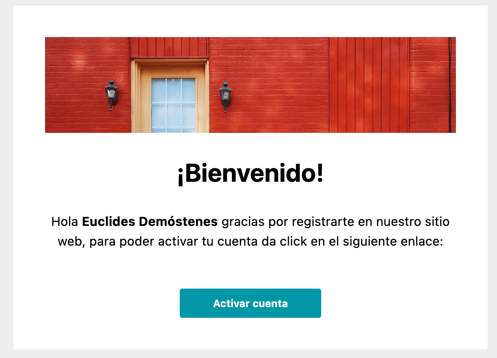

#### Métodos

- **MergeVariables**: Fusionar a un HTML variables (utiliza Handlebars)
```js
const html = acornmail.MergeVariables(
  '<div>{{Title}}</div>',
  { Title: 'Hola mundo' },
);
console.log('MergeVariables', html);
```

- **NewAcornEmailComponents**: Obtener el tipo **acornEmail** para poder construir un template
```js
const acorn = acornmail.NewAcornEmailComponents()
```

#### Componentes

- **GetBoilerplate**
```js
const boilerplate = acorn.GetBoilerplate([
    "Header",
    "Body",
    "Footer",
    // n componentes...
])
console.log({ boilerplate })
```

- **Spacer**
```js
const acorn = acornmail.NewAcornEmailComponents();
const spacer = acorn.NewSpacer();
const boilerplate = acorn.GetBoilerplate([spacer], true);

console.log({ boilerplate })
```


- **Divider**
```js
const acorn = acornmail.NewAcornEmailComponents();
const { colors } = acornmail.acornStyles;
const divider = acorn.NewDivider(colors.DeepPurple.M700);
const boilerplate = acorn.GetBoilerplate([divider], true);

console.log({ boilerplate })
```
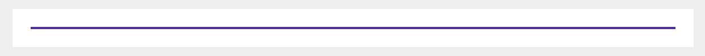

- **Label**
```js
const acorn = acornmail.NewAcornEmailComponents();

const labelFilled = acorn.NewLabel({
  Text: 'filled label',
});

const labelOutlined = acorn.NewLabel({
  Text: 'outlined label',
  Styles: {
    Outlined: true,
  },
});

const boilerplate = acorn.GetBoilerplate([
  labelFilled,
  labelOutlined,
]);

console.log({ boilerplate })
```
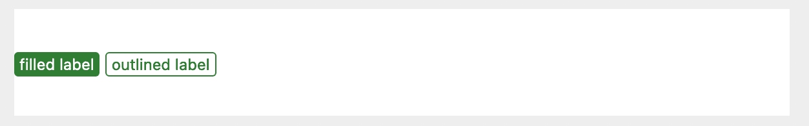

- **Image**
```js
const acorn = acornmail.NewAcornEmailComponents();

const image = acorn.NewImage({
  Image: 'https://fastly.picsum.photos/id/284/536/354.jpg?hmac=e8lLizGxaVIQy3ILytDAkWUwFvYLGAzDiqQU20owvHY',
  Alt: 'Logo',
});

const boilerplate = acorn.GetBoilerplate([image]);

console.log({ boilerplate })
```

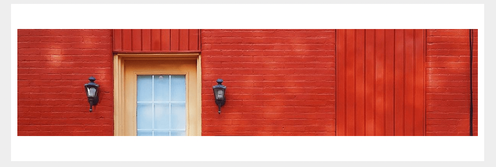

- **Row**
```js
const acorn = acornmail.NewAcornEmailComponents();

const widthColumns = acornmail.acornStyles.columns;
const { colors } = acornmail.acornStyles;

const row = acorn.NewRow([
  {
    Content: '1/4 de columna',
    Styles: {
      Width: widthColumns.Quarter,
    },
  },
  {
    Content: '1/2 de columna',
    Styles: {
      Width: widthColumns.Medium,
      Color: colors.Purple.M700,
      TextColor: colors.White,
    },
  },
  {
    Content: '1/4 de columna',
    Styles: {
      Width: widthColumns.Quarter,
    },
  },
]);

const boilerplate = acorn.GetBoilerplate([row]);

console.log({ boilerplate })
```
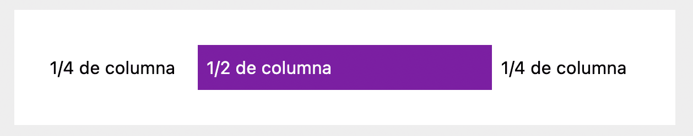

- **Grid**
```js
const acorn = acornmail.NewAcornEmailComponents();

const widthColumns = acornmail.acornStyles.columns;
const { colors } = acornmail.acornStyles;

const grid = acorn.NewGrid([
  [
    {
      Content: '100%',
      Styles: {
        Width: widthColumns.Full,
        Color: colors.Purple.M700,
        TextColor: colors.White,
      },
    },
  ],
  undefined, // Add spacer
  [
    {
      Content: '1/2 de columna',
      Styles: {
        Width: widthColumns.Medium,
      },
    },
    {
      Content: '1/2 de columna',
      Styles: {
        Width: widthColumns.Medium,
      },
    },
  ],
]);

console.log({ boilerplate })
```

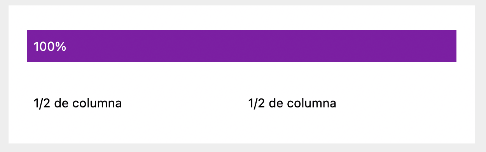

- *Content*
```js
const acorn = acornmail.NewAcornEmailComponents();

const widthColumns = acornmail.acornStyles.columns;
const { colors } = acornmail.acornStyles;

const row = acorn.NewRow([
  {
    Content: '1/4 de columna',
    Styles: {
      Width: widthColumns.Quarter,
      TextColor: colors.White,
    },
  },
  {
    Content: '1/2 de columna',
    Styles: {
      Width: widthColumns.Medium,
      Color: colors.Purple.M700,
      TextColor: colors.White,
    },
  },
  {
    Content: '1/4 de columna',
    Styles: {
      Width: widthColumns.Quarter,
      TextColor: colors.White,
    },
  },
]);

const content = acorn.NewContent({
  Content: row,
  Image: 'https://picsum.photos/1200/800?image=837',
});

const boilerplate = acorn.GetBoilerplate([content]);

console.log({ boilerplate })
```
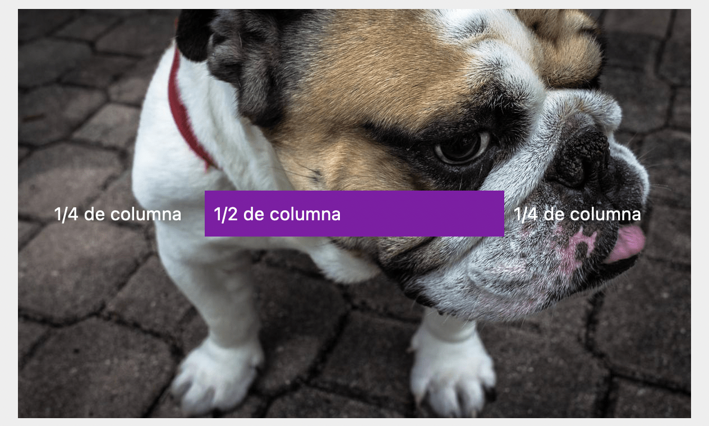

```js
const acorn = acornmail.NewAcornEmailComponents();

const widthColumns = acornmail.acornStyles.columns;
const { colors } = acornmail.acornStyles;

const row = acorn.NewRow([
  {
    Content: '1/4 de columna',
    Styles: {
      Width: widthColumns.Quarter,
      TextColor: colors.White,
    },
  },
  {
    Content: '1/2 de columna',
    Styles: {
      Width: widthColumns.Medium,
      Color: colors.Purple.M700,
      TextColor: colors.White,
    },
  },
  {
    Content: '1/4 de columna',
    Styles: {
      Width: widthColumns.Quarter,
      TextColor: colors.White,
    },
  },
]);

const content = acorn.NewContent({
  Content: row,
  // Image: 'https://picsum.photos/1200/800?image=837',
});

const boilerplate = acorn.GetBoilerplate([content], true);

console.log({ boilerplate })
```
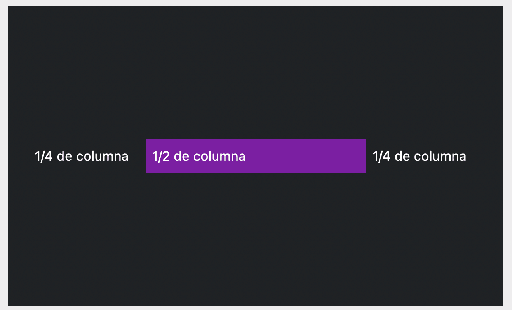

- **Alerts**
```js
const acorn = acornmail.NewAcornEmailComponents();

const divider = acorn.NewDivider();

const alert = acorn.NewAlert({
  Content: 'Alert',
});

const alertOutlined = acorn.NewAlert({
  Content: 'Alert',
  Styles: {
    Outlined: true,
  },
});

const boilerplate = acorn.GetBoilerplate([
  alert,
  divider,
  alertOutlined,
]);

console.log({ boilerplate })
```
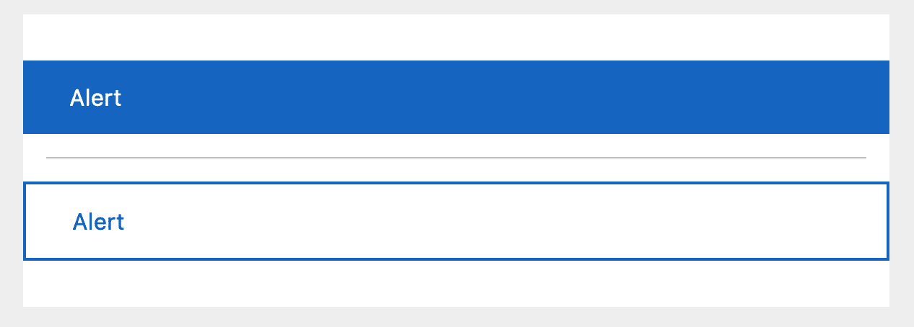

- **Buttons**
```js
const acorn = acornmail.NewAcornEmailComponents();

const { types } = acornmail.acornStyles;
const aligns = acornmail.acornStyles.align;
const widthColumns = acornmail.acornStyles.columns;

const buttonFilled = acorn.NewButton({
  Text: 'Filled button',
  Link: 'http://docs.thememountain.com/acorn/',
  Styles: {
    FullWidth: true,
  },
});

const buttonOutlined = acorn.NewButton({
  Text: 'Outlined button',
  Link: 'http://docs.thememountain.com/acorn/',
  Styles: {
    Type: types.Outlined,
  },
});

const buttonPhill = acorn.NewButton({
  Text: 'Pill button',
  Link: 'http://docs.thememountain.com/acorn/',
  Styles: {
    Type: types.Pill,
    Align: aligns.Center,
  },
});

const grid = acorn.NewGrid([
  [
    {
      Content: buttonFilled,
      Styles: {
        Width: widthColumns.Full,
      },
    },
  ],
  undefined, // Add spacer
  [
    {
      Content: buttonOutlined,
      Styles: {
        Width: widthColumns.Medium,
      },
    },
    {
      Content: buttonPhill,
      Styles: {
        Width: widthColumns.Medium,
      },
    },
  ],
]);

console.log({ boilerplate })
```
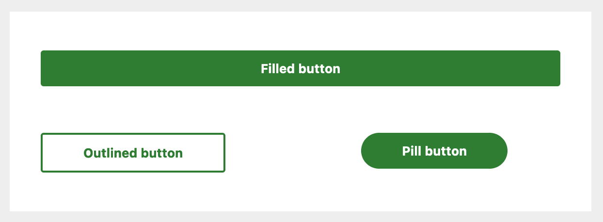

- **Accordion**
```js
const acorn = acornmail.NewAcornEmailComponents();

const { colors } = acornmail.acornStyles;

const accordion = acorn.NewAccordion([
  {
    Title: 'Panel 1',
    Content: 'Lorem ipsum dolor sit amet, consectetur adipisicing elit.',
  },
  {
    Title: 'Panel 2',
    Content: 'Lorem ipsum dolor sit amet, consectetur adipisicing elit.',
    Styles: {
      Color: colors.Cyan.M300,
      TitleColor: colors.White,
      ContentColor: colors.Cyan.M300,
    },
  },
]);

const boilerplate = acorn.GetBoilerplate([accordion]);

console.log({ boilerplate })
```
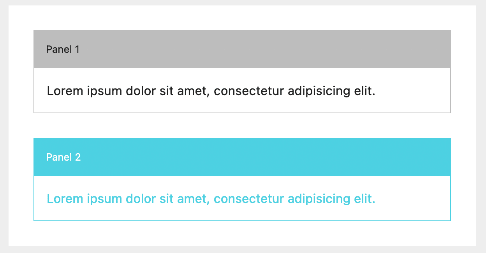

- **Timeline**
```js
const acorn = acornmail.NewAcornEmailComponents();

//== Limitaciones ==//
// Time: Max 11 caracteres
// Title: Max 37 caracteres
// Content: Max 78 caracteres

const timeline = acorn.NewTimeline([
  {
    Time: '2007 - 2008',
    Title: 'Massachusetts Institute of Technology',
    Content: 'Co-wrote a book on the Semantic Web and Best Practices for Developers.',
  },
  {
    Time: '2004 - 2006',
    Title: 'Parsons School of Design',
    Content: 'Awarded Best Designer of the Year voted by student and teacher body.',
  },
  {
    Time: '2002 - 2004',
    Title: 'Berkley College',
    Content: 'Two year program with a focus on design principles and Javascript development.',
  },
]);

const boilerplate = acorn.GetBoilerplate([timeline]);

console.log({ boilerplate })
```
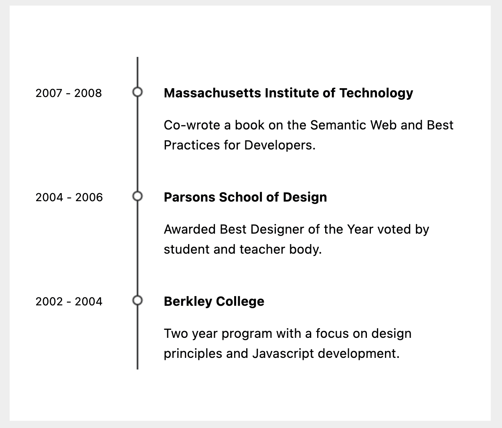

- **Testimonial**
```js
const acorn = acornmail.NewAcornEmailComponents();

const aligns = acornmail.acornStyles.align;
const { colors } = acornmail.acornStyles;

const testimonialBorder = acorn.NewTestimonial({
  Testimonial: 'Sometimes when you innovate, you make mistakes. It is best to admit them quickly, and get on with improving your other innovations.',
  Author: 'Steve Jobs',
  Styles: {
    BorderColor: colors.Orange.M500,
  },
});

const testimonialIcon = acorn.NewTestimonial({
  Testimonial: 'Sometimes when you innovate, you make mistakes. It is best to admit them quickly, and get on with improving your other innovations.',
  Author: 'Steve Jobs',
  Icon: true,
});

const testimonialImage = acorn.NewTestimonial({
  Testimonial: 'Sometimes when you innovate, you make mistakes. It is best to admit them quickly, and get on with improving your other innovations.',
  Author: 'Steve Jobs',
  Styles: {
    Image: 'https://gravatar.com/avatar/5ad269974f4c69c9ff6eca2ad2d1d0b8?s=400&d=robohash&r=x',
    Align: aligns.Center,
  },
});

const boilerplate = acorn.GetBoilerplate([
  testimonialBorder,
  testimonialIcon,
  testimonialImage,
]);

console.log({ boilerplate })
```
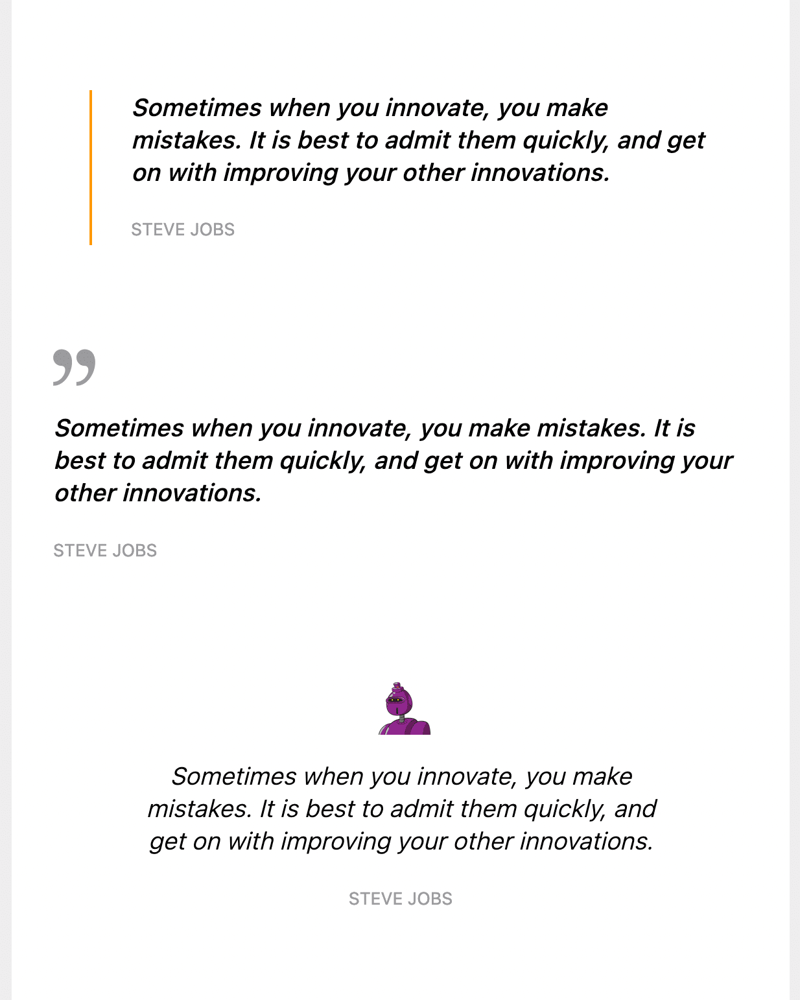

- **Promo**
```js
const acorn = acornmail.NewAcornEmailComponents();

const promo = acorn.NewPromo({
  Promo: { Value: '25' },
  Symbol: { Value: '%' },
  Description: { Value: 'OFF' },
});

const boilerplate = acorn.GetBoilerplate([promo]);

console.log({ boilerplate })
```


```js
const acorn = acornmail.NewAcornEmailComponents();

const { sizes } = acornmail.acornStyles;

const promo = acorn.NewPromo({
  Promo: { Value: '25', Size: sizes.Px108 },
  Symbol: { Value: '%', Size: sizes.Px36 },
  Description: { Value: 'OFF', Size: sizes.Px24 },
});

const boilerplate = acorn.GetBoilerplate([promo]);

console.log({ boilerplate })
```


- **Coupon**
```js
const acorn = acornmail.NewAcornEmailComponents();

const color = acornmail.acornStyles.colors;
const aligns = acornmail.acornStyles.align;

const coupon = acorn.NewCoupon({
  Content: acorn.NewGrid([
    [{
      Content: `
      <div style="font-size: 13px; text-transform: uppercase;">¡Gracias por registrarte!<br>Disfruta</div>
      <div style="font-size: 72px; font-weight: 700; line-height: 100%;">$10 DESC</div>
      <div class="spacer py-sm-8" style="line-height: 16px;">‌</div>
      <div style="font-size: 20px; letter-spacing: 2px; line-height: 100%; text-transform: uppercase;">En tu primera compra</div>
      `,
      Styles: {
        Align: aligns.Center,
        TextColor: color.White,
      },
    }],
    undefined,
  ]),
  Button: {
    Link: 'https://www.example.com',
    Text: 'COMPRA AHORA',
    Styles: {
      Color: color.White,
      TextColor: color.Blue.M500,
      Align: aligns.Center,
    },
  },
});

const boilerplate = acorn.GetBoilerplate([coupon]);

console.log({ boilerplate })
```


```js
const acorn = acornmail.NewAcornEmailComponents();

const color = acornmail.acornStyles.colors;
const aligns = acornmail.acornStyles.align;

const promo = acorn.NewPromo({
  Promo: { Value: '25' },
  Symbol: { Value: '%' },
  Description: { Value: 'DESC' },
});

const label = acorn.NewLabel({
  Text: '25OFFTODAY',
  Styles: {
    Outlined: true,
    TextColor: color.Red.M500,
    Color: color.Red.M500,
  },
});

const coupon = acorn.NewCoupon({
  Content: acorn.NewGrid([
    [{ Content: promo }],
    [{
      Content: `Con el cupón ${label}`,
      Styles: {
        Align: aligns.Center,
        TextColor: color.Grey.M400,
      },
    }],
    undefined,
  ]),
  Button: {
    Link: 'https://www.example.com',
    Text: 'Canjear cupón →',
    Styles: {
      Color: color.Black,
      TextColor: color.White,
      Align: aligns.Center,
    },
  },
  Styles: {
    Dashed: true,
  },
});

const boilerplate = acorn.GetBoilerplate([coupon]);

console.log({ boilerplate })
```
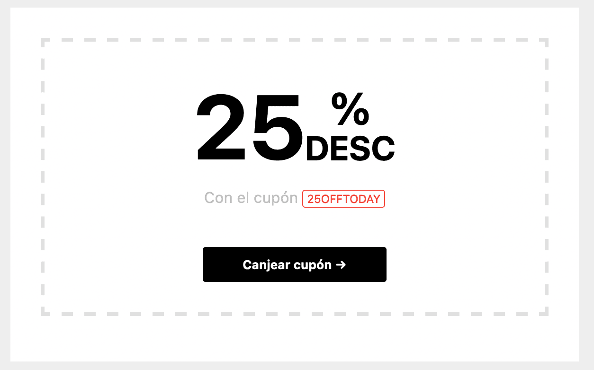

#### Estilos

- *Tipo de botones*

```js
const types = acornmail.acornStyles.type
console.log({ types.Filled })
console.log({ types.Outlined })
console.log({ types.Pill })
```

- *Alineaciones*

```js
const aligns = acornmail.acornStyles.align
console.log({ aligns.Center })
console.log({ aligns.Right })
console.log({ aligns.Left })
```

- *Tamaños de letra*

```js
const { sizes } = acornmail.acornStyles
console.log({ sizes.Px12 })
console.log({ sizes.Px24 })
console.log({ sizes.Px36 })
console.log({ sizes.Px48 })
console.log({ sizes.Px60 })
console.log({ sizes.Px72 })
console.log({ sizes.Px84 })
console.log({ sizes.Px96 })
console.log({ sizes.Px108 })
console.log({ sizes.Px120 })
```

- *Ancho de columnas*

```js
const { columns } = acornmail.acornStyles
console.log({ columns.Full }) // 100%
console.log({ columns.Quarter }) // 1/4
console.log({ columns.Medium }) // 1/2
console.log({ columns.ThreeQuarters }) // 3/4
console.log({ columns.OneThird }) // 1/3
console.log({ columns.TwoThird }) // 2/3
```

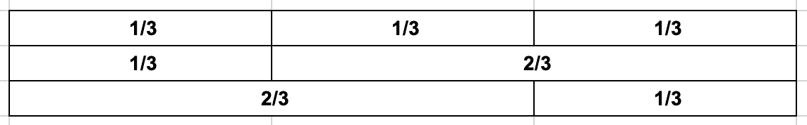
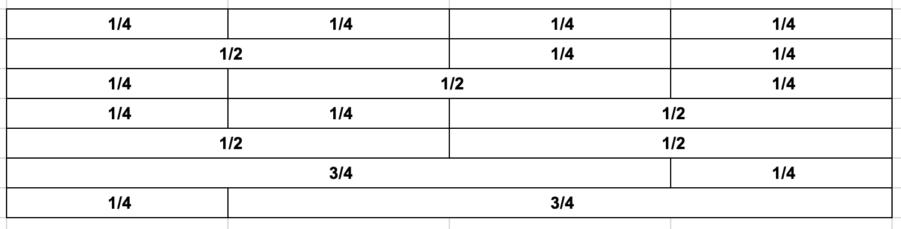

- *Colores*

```js
const { colors } = acornmail.acornStyles
const red50 = colors.Red.M50
console.log({ red50 })

// Only hexadecimal string
```

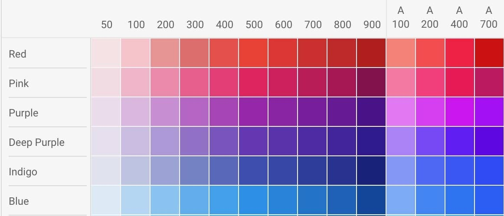
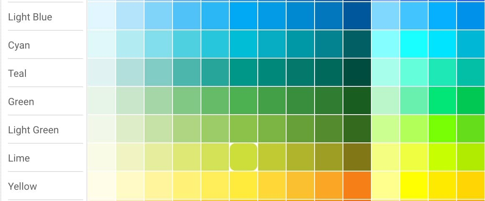
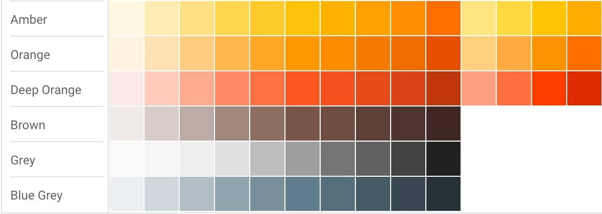
